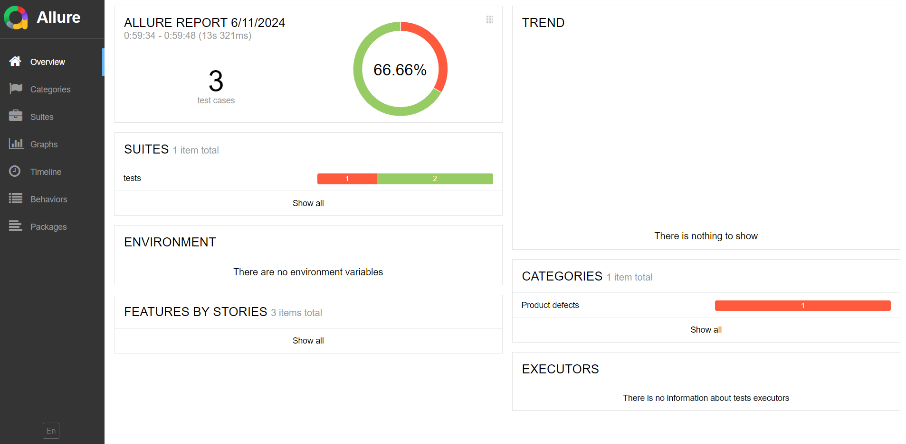
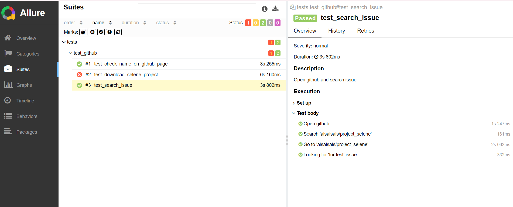
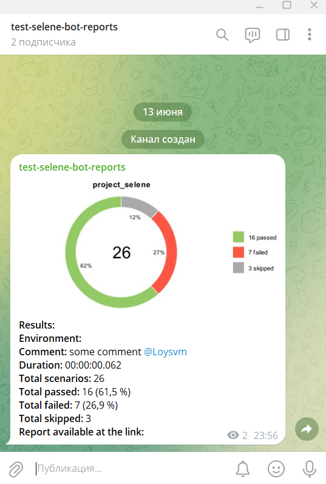

### Website automation project using pytest + selene + allure

for working with project use terminal:
1. for install requirements: pip install -r requirements.txt
2. to run all tests: pytest
3. to run one test: pytest tests/test_github.py::test_download_selene_project
4. to generate reports after test run: allure serve tests/allure-results

#### allure reports:

#### notifications bot:
https://t.me/test_selen_bot
